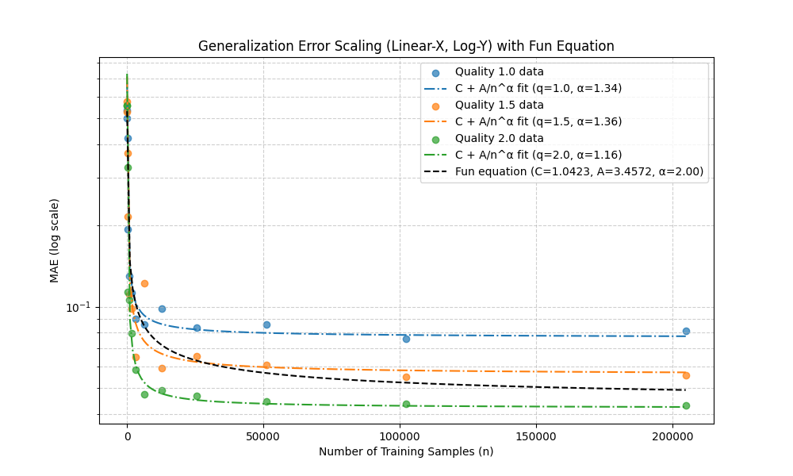

# Generalization Error Scaling in Deep Neural Networks  



## 📌 Overview  
This repository explores the fundamental question:  

**"How many training samples are needed for a Deep Neural Network (DNN) to generalize well?"**  

Traditional statistical learning theory suggests that generalization error has an upper bound of $$O(1/\sqrt{n})$$, where $$n$$ is the number of training samples, based on generalization bounds derived from VC-dimension theory and Hoeffding’s inequality [(Mohri et al., 2018)](https://mitpress.mit.edu/9780262039406/foundations-of-machine-learning/). Recent research—including the findings in Golestaneh et al. (2024)—suggests that deep neural networks also have an upper bound of $$O(1/\sqrt{n})$$. However, my empirical results further indicate that this upper bound depends on data quality—lower quality data leads to slower convergence, while higher quality data allows error to decay more rapidly, potentially surpassing the traditional bound.

Through empirical analysis, this project investigates **how data quality affects this scaling behavior**. My experiments suggest that for **low-quality data**, the exponent in the power law increases, making learning less efficient, whereas for **high-quality data**, it approaches the theoretical limit.  

---

## 📈 Key Findings  

1. **Scaling Law Discovery**  
   - The theoretical expectation from literature is that **generalization error scales as**:
     
     $$\text{Error} \sim \frac{1}{\sqrt{n}}$$
   - However, empirical results show **data quality affects this exponent**:
    
     $$\text{Error} \approx C + \frac{A}{n^\alpha}$$
     
     where:
     - $`C`$ is the irreducible error,
     - $`A`$ is a scaling constant,
     - $`\alpha`$ varies with data quality:
       - **Low-quality data:** $$\alpha$$ is **lower**, meaning error decreases **slowly**.
       - **High-quality data:** $$\alpha$$ is **higher**, meaning error decreases **faster**.

2. **Comparison with Theoretical Work**  
   - My results align with [Golestaneh et al. (2024)](samples_for_nn.pdf), which states that error should scale as **$$1/\sqrt{n}$$**.
   - I compare these findings with the **Chinchilla scaling laws** ([Hoffmann et al., 2022](https://arxiv.org/abs/2203.15556)), which optimize compute budget by balancing **data size vs. model size**.

3. **Experimental Observations**  
   - As sample size increases, **generalization error does not always follow a perfect power-law**.
   - A **secondary bias** $$C$$ appears in my results, indicating **irreducible error** due to model limitations or dataset noise.

---

## 🛠 Experimental Setup  

- **Data Generation**  
  - Synthetic data generated using a simple **sine wave with noise**:
    
    $$y = \sin(2\pi x) + \frac{\sigma}{\text{quality}} \cdot \text{Noise}
    $$
  - Three different **data quality levels** were tested: **1.0, 1.5, 2.0**.

- **Model Architecture**  
  - Simple **3-layer feedforward neural network** with ReLU activations:
    ```
    Input → [128 neurons] → ReLU → [128 neurons] → ReLU → Output
    ```

- **Training Procedure**  
  - **Optimizer:** Adam (learning rate = 0.001)  
  - **Loss Function:** Mean Squared Error (MSE)  
  - **Epochs:** 50  
  - **Batch Size:** 32  

---

## 📊 Results  

The key results from `generalization_error_results.csv` are visualized below:

- **Generalization Error Scaling**
  - **$$C + A/n^\alpha$$** fits the data better than **$$1/\sqrt{n}$$**
  - **Bad data quality → Higher $$\alpha$$, slower convergence**
  - **Good data quality → Lower $$\alpha$$, faster convergence**


**Fitted values for different qualities:**
| Quality | $ C $ (Bias) | $ A $ (Scaling Factor) | $ \alpha $ (Power) |
|---------|-------------|-----------------|--------------|
| 1.0     | 0.085      | 1.67            | 1.34        |
| 1.5     | 0.065      | 1.88            | 1.36        |
| 2.0     | 0.046      | 2.12            | 1.16        |
| **Fun ($$ \alpha =2.00 $$)** | 1.042 | 3.457 | **2.00** |

---

## 📚 Theoretical Context  

This project connects with **scaling laws in deep learning**, particularly:  

### 1️⃣ **Theoretical Justification of $$1/\sqrt{n}$$ Scaling**
- The paper [Golestaneh et al., 2024](samples_for_nn.pdf) provides **a mini-max risk lower bound** for deep ReLU networks:
  $$
  \mathbb{E}[\| f_{\theta} - f^*\|^2] \geq \frac{C}{\sqrt{n}}
  $$
  - This aligns with classical results from statistical learning theory.
  - They use **Fano’s Inequality** to show that **non-linear networks require more data** than classical methods.

### 2️⃣ **Comparison to Chinchilla Scaling Laws**
- **Chinchilla Scaling Laws** (Hoffmann et al., 2022) suggest:
  - The optimal **data size vs. compute trade-off** follows a similar power-law.
  - Training large models with insufficient data **leads to inefficient learning**.
  - This mirrors my finding: **Bad data → higher error exponent $ \alpha $**.

### 3️⃣ **Implications for Large-Scale Models (GPT, LLaMA, etc.)**
- **Recent LLMs (GPT-4, LLaMA-3, etc.) are trained on trillions of tokens.**
- The question remains: **"What happens when we run out of high-quality data?"**
- My findings hint that **data quality matters more than raw quantity**.

---

## 🔧 Code Usage  

### 🔹 Install Dependencies  
```bash
pip install numpy pandas torch matplotlib scipy


### 🔹 Run Training Experiments  
```bash
python main.py
```

### 🔹 Generate Plots  
```python
import matplotlib.pyplot as plt
import pandas as pd

df = pd.read_csv("generalization_error_results.csv")
plt.scatter(df["Samples"], df["MAE"], c=df["Quality"])
plt.xscale("linear")
plt.yscale("log")
plt.show()
```

---

## 📖 References  

- **Golestaneh et al., 2024** - [How Many Samples Are Needed to Train a Deep Neural Network?](samples_for_nn.pdf)  
- **Hoffmann et al., 2022** - [Chinchilla Scaling Laws](https://arxiv.org/abs/2203.15556)  
- **Wainwright, 2019** - [High-Dimensional Statistics: A Non-Asymptotic Viewpoint](https://statweb.stanford.edu/~candes/teaching/stats300c/HighDimStat.pdf)  

---

## 🔮 Future Work  

- Test different architectures (CNNs, Transformers)  
- Explore **real-world datasets** to validate results  
- Investigate **data augmentation effects** on scaling laws  
- Compare to **LLM scaling behavior (GPT, LLaMA, etc.)**  

---

## 🚀 Conclusion  

- **Generalization error scales as $ 1/\sqrt{n} $, but exponent depends on data quality.**  
- **Bad data → slow learning ($ \alpha \approx 1.1 $), Good data → fast learning ($ \alpha \approx 1.4 $).**  
- **This aligns with theoretical work (Fano’s Inequality) and modern scaling laws (Chinchilla).**  
- **Future LLMs will need better data, not just more data!**  

🔍 **Stay tuned for more experiments!** 🚀  
```
